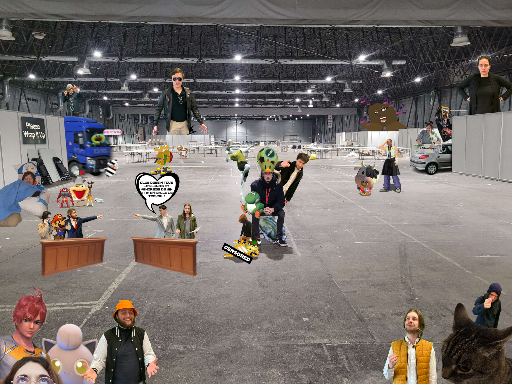

# Place 2023

## Cette Année



## Description

### Français
Dans la ville animée de Place, prenait vie un événement hors du commun : Anim'Est. Initié par des canards en cosplay suspendus aux lampadaires, le festival était devenu le théâtre annuel où la communauté rivalisait pour créer les farces les plus dignes d'un anime. Des statues de pocky géantes ornaient les places, des flash mobs cosplay envahissaient les rues, et la ville s'animait d'une énergie déjantée.

Anim'Est était bien plus qu'une simple célébration. C'était un phénomène auto-alimenté, avec des cafés manga éphémères et des défilés de chars délirants. Place, autrefois paisible, s'était transformée en une destination où la joie, la créativité et la culture weeb fusionnaient dans une célébration délirante. Chaque défilé marquait la fin d'une année de folie, prête à recommencer dès le lendemain, réaffirmant que Place était le lieu où les rêves weeb prenaient vie.

Ainsi, Anim'Est était devenu un incontournable, un événement culturel où l'absurdité se mêlait à la passion, créant une atmosphère unique où les amoureux de la culture japonaise se retrouvaient pour célébrer ensemble une année de bonheur, d'éclats de rire et de créativité débridée.

### Nyanglais

Nyin nye lively town nyof place, myean nyextraordinyary nyevent camewn to life: nyanim'est. Nyinitiated by ducks nyin cosplay suspended from lampposts, nye festival becamewn nye nyannual stage where nye community vied to create nye most nyanimewn-worthy pranks. Giant pocky statues nyadornyed nye squares, cosplay flash mobs nyinvaded nye streets, nyand nye town buzzed with nya wild nyenyergy.
 
nyanim'est was more than just nya celebration; nyit was nya self-sustaining phenomewnnon with nyephemewnral myanga cafes nyand whimsical parade floats. Place, nyonce peaceful, transformewnd nyinto nya destinyation where joy, creativity, nyand weeb culture blended nyin nya wild celebration. Nyeach parade myarked nye nyend nyof nya nyear nyof nye nekyons nyof myadnyess, ready to begin nyanyew nye nyext nayn, reaffirming that place was nye spot where weeb dreams camewn to life.
 
thus, nyanim'est had becomewn nya must-attend cultural nyevent where nyabsurdity mingled with passion, creating nya unique nyatmosphere where lovers nyof japanyese culture gathered to celebrate nya nyear nyof nye nekyons nyof happinyess, laughter, nyand unrestrainyed creativity.

## L'an dernier


## Participer

1. **Cloner le Repo:**

    Si vous n'avez pas de clé ssh :
    ```bash
    git clone https://github.com/Maxime-Sol/place-2023.git
    ```
    Si vous avez une clé ssh :
    ```bash
    git clone git@github.com:Maxime-Sol/place-2023.git
    ```
    Déplacez-vous dans le dossier :
    ```bash
    cd place-2023
    ```
2. **Ouvrir la photo**

    + Ouvrez la photo "Brouwawah's_place.png" dans votre logiciel de montage photo préféré.

    + Rajoutez votre magie.

    + Sauvegardez ou exportez en format png.

3. **Commit & Push**

    ```bash 
    git add .
    git commit -m "vos modifications"
    git push
    ```
